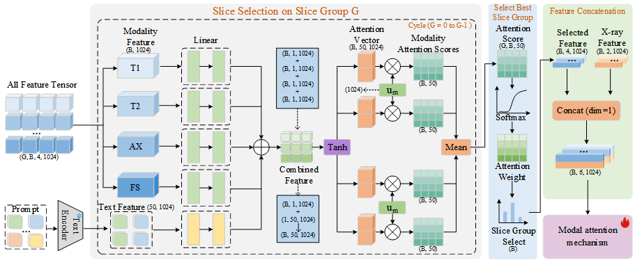
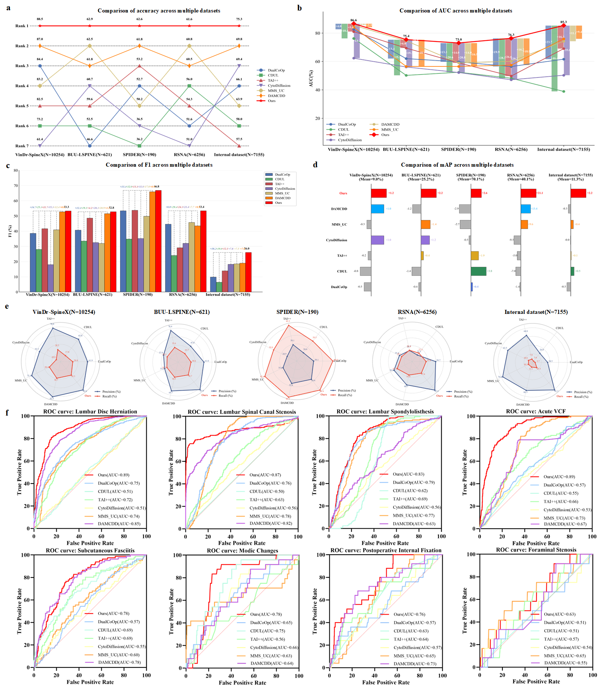
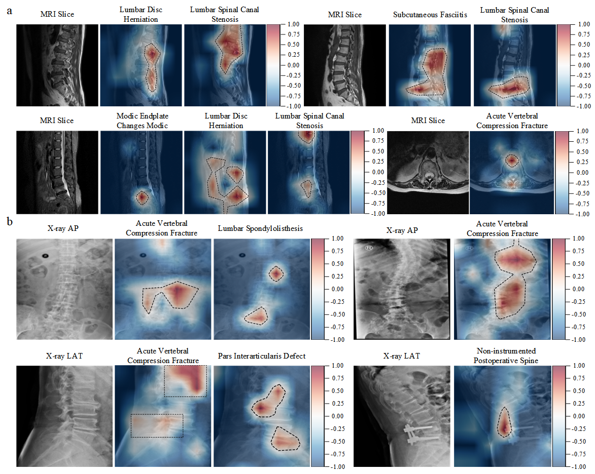

# ABSTRACT

Spinal diseases are among the leading causes of pain and disability worldwide, and accurate diagnosis often requires integrating X-ray, multi-sequence MRI and information on comorbid conditions. Current artificial intelligence systems remain limited by single-modality inputs and insufficient modeling of multi-label disease relationships. We present SpineModel, a multimodal foundation model for multi-label diagnosis of spinal diseases. SpineModel is designed to align with clinical diagnostic workflows by selecting disease-relevant MRI slices, dynamically weighting different imaging modalities and modeling inter-disease relationships. We constructed the first paired multimodal spinal imaging dataset comprising 7155 patients and further evaluated SpineModel on four public single-modality imaging datasets comprising 17321 cases. SpineModel achieved an AUC of 85.3% (95% CI: 84.0%, 86.6%) in the internal cohort and showed the best overall performance compared with six representative methods on public datasets. A reader study demonstrated that SpineModel helped clinicians improve diagnostic accuracy and reduce reading time. 

# Key model structure diagram
## Disease-aware slice selection mechanism

In spinal MRI, many critical lesions are not uniformly distributed throughout the entire volumetric data but are instead concentrated in a few key slices. If average pooling or simple sequential aggregation is applied directly to all MRI slices, the lesion signals may be diluted by a vast amount of normal anatomical background, thereby reducing the model's ability to identify focal lesions. As noted in the main text, the purpose of the disease-aware slice selection mechanism is precisely to select the most diagnostically valuable MRI slices for different diseases based on disease semantic embeddings and slice visual features.


Detailed model diagrams and introductions of the other two core modules, namely the **Expert Prior Knowledge-Guided Modality Attention Mechanism** and **Label-Coupled Hierarchical Mixture-of-Experts**, are presented in the supplementary materials of the paper.

# Installation Instructions

## 1. Environment Configuration:

- python==3.9.25
- timm==1.0.7
- tokenizers==0.22.2
 - torch==2.6.0+cu118
- torchaudio==2.6.0+cu118
- torchvision==0.21.0+cu118
- opencv-python==4.12.0.88
- opencv-python-headless==4.12.0.88
- openpyxl==3.1.5
- packaging==25.0
- pandas==2.3.3
- pillow==11.3.0
- pydicom==2.4.4
- scikit-learn==1.6.1
- scipy==1.13.1
- seaborn==0.13.2

...

The environment.yml contains all the necessary environment configurations for this project. Training and validation were conducted on a 24GB RTX 3090 GPU with CUDA 11.8.

```python
conda env create -f environment.yml
```

## 2. Data Preprocessing:

1. First, process MRI files by converting DICOM files of each sequence to H5 format. Execute:

```python
python utils/spine_process/DICOM2H5/dic2h5.py   # Remember to update the paths in dic2h5.py
```

2. Next, merge the H5 files of each sequence into a single H5 file. Execute:

```python
python utils/spine_process/DICOM2H5/allh5.py   # Remember to update the paths in allh5.py
```

3. Process X-Ray DICOM files by converting each DICOM file to JPG format. Execute:

```python
python utils/spine_process/DICOM2JPG/dic2jpg.py   # Remember to update the paths in dic2jpg.py
```

4. Generate CSV files for subsequent use by executing the following command. This step will generate two files: train.csv and valid.csv.

```python
python utils/spine_process/gencsv.py   # Remember to update the paths in gencsv.py (lines 135-136 and lines 97-99)
```

5. Process the two CSV files generated in step 4. This step primarily fills in labels for subsequent JSON file generation. (Note: The dataset directory must contain a file named all.csv, which includes case_id_raw and various category labels. The case_id_raw column contains imaging folder names, e.g., "7290809PA4x"). After this step, two files will be generated: train_with_process.csv and valid_with_process.csv.

```python
python utils/spine_process/process_csv.py   # Remember to update the paths in process_csv.py
```

6. Generate JSON files required for subsequent training and inference. Executing the following command will generate two JSON files in the specified directory:

```python
python utils/preprocess/spine_csv2jsonl.py   # Remember to update the paths in spine_csv2jsonl.py
```

7. Calculate the mean and std of X-Ray files in the training set for subsequent training. Note: Copy the calculated mean and std values to the /configs/dataset/**first_XMRI.yaml** file.

```python
python utils/preprocess/spine_dataset_info_calculator.py   # Remember to update the paths in spine_dataset_info_calculator.py
```

**At this point, the data preprocessing steps are complete.**

## 3. Start Model Training:

Before starting model training, you need to update paths and corresponding names in some files.

**first_XMRI.yaml:** Remember to update the NAME and ROOT parameter values

**/utils/cfg_builder.py**: Remember to update C.DATASET.ROOT and C.DATASET.NAME parameter values; this file contains definitions of various hyperparameters.

**build_dataset.py**: Remember to update the parameters in line 17

Execute the following command to train the model:

```python
CUDA_VISIBLE_DEVICES=1 python train.py -nc configs/model/RN50.yaml -dc configs/dataset/first_XMRI.yaml --dataset_dir /data3/whz/spinedataset/ --decoder_hidden 512 --max_epochs 50 --output_dir /data4/whz/output/ --test_file_path /data3/whz/SpineModel/datasets/spine_valid_labels.json --val_file_path /data3/whz/SpineModel/datasets/spine_valid_labels.json --train_file_path /data3/whz/SpineMOdel/datasets/spine_train_labels.json --start_afresh
```

In the command above, **RN50.yaml** sets some hyperparameters for training, **first_XMRI.yaml** contains hyperparameter settings for the dataset, **--dataset_dir** is the absolute path to the dataset (pay attention to the correct location), **--max_epochs** is the number of training epochs, **--output_dir** is the output path for model weights and other files, **--test_file_path**, **--val_file_path**, and **--train_file_path** are the paths to JSON files for test, validation, and training sets respectively, and **--start_afresh** indicates whether to start training from scratch (default is False).

## 4. How to apply SpineModel to your own dataset:

The following files need to be modified accordingly based on your dataset.
- build_dataset.py
- validator.py
- cxr_dataset.py: add new categories
- cfg_builder.py
- trainer.py
- test_hierarchical_moe.py
- SpineModel.py

# Performance demonstration of SpineModel
## 1.Comparative experiments of SpineModel with six methods across five datasets


## 2. Grad-CAM visualization

